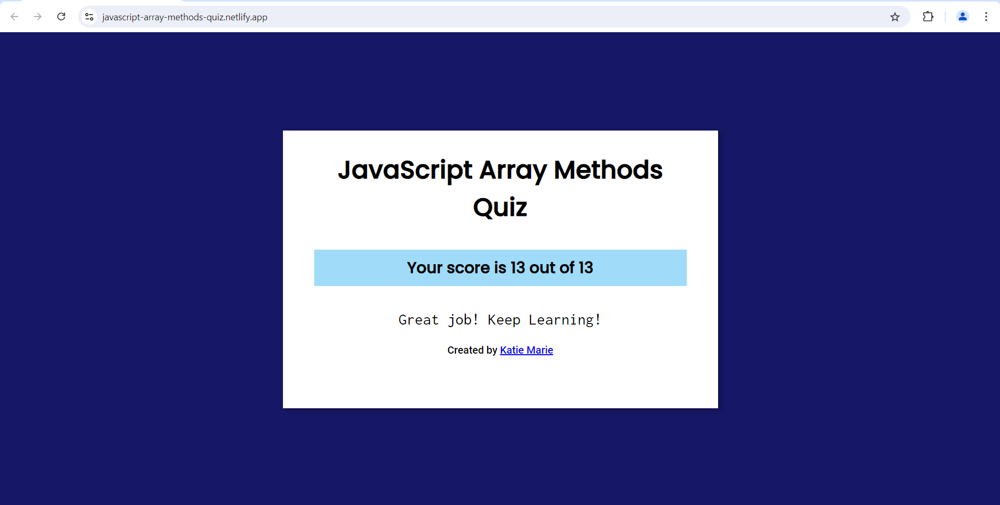

1. Write short notes on Array methods with code example
- push()
- pop()
- shift()
- unshift()
- includes()
- toString()
- reverse()
- join()
- concat()
- flat()
- slice()
- splice()

Ans.
* push() : This method in JavaScript is used to add one or more elements to the end of an array.

- Eg :
```js
let fruits = ["Apple", "Banana"];
fruits.push("Orange", "Mango");

console.log(fruits);
```
* pop() : This method in JavaScript is used to remove the last element from an array and return that element.

- Eg :
```js
let fruits = ["Apple", "Banana", "Cherry"];
let lastFruit = fruits.pop();

console.log(fruits);
console.log(lastFruit);
```
* shift() : This method in JavaScript is used to remove the first element from an array and return that removed element.

- Eg :
```js
const fruits = ["Banana", "Orange", "Apple", "Mango"];
const firstFruit = fruits.shift();

console.log(firstFruit);
```
* unshift() : This method in JavaScript is used to add one or more elements to the beginning of an array.

- Eg :
```js
let arr = [3, 4, 5];
arr.unshift(1, 2);
console.log(arr);
```
* include() :  Tmethod in JavaScript is used to determine whether an array contains a specific value.

- Eg :
```js
const fruits = ["Banana", "Orange", "Apple", "Mango"];
console.log(fruits.includes("Mango"));
```
* tostring() :  This method in JavaScript converts an array to a string, with each element separated by a comma.

- Eg :
```js 
const fruits = ["Banana", "Orange", "Apple", "Mango"];
let text = fruits.toString();
console.log(text);
```
* reverse() :  This method reverses the order of the elements in the array and modifies the original array.

- Eg :
```js
let numbers = [1, 2, 3, 4, 5];
numbers.reverse();
console.log(numbers);
```
* join() : This method in JavaScript is used to combine all elements of an array into a single string. You can specify a separator to be placed between each element in the resulting string.

- Eg :
```js
const fruits = ["Banana", "Orange", "Apple", "Mango"];
let result = fruits.join(", ");
console.log(result);
```
* concat() : This method in JavaScript is used to merge two or more arrays.

- Eg :
```js
const arr1 = ["Cecilie", "Lone"];
const arr2 = ["Emil", "Tobias", "Linus"];
const children = arr1.concat(arr2);
console.log(children);
```
* flat() : method in JavaScript is used to create a new array with all sub-array elements concatenated into it recursively up to the specified depth.

- Eg :
```js
const arr1 = [1, 2, [3, 4]];
console.log(arr1.flat());
```
* slice() : method in JavaScript is used to create a shallow copy of a portion of an array into a new array object.

- Eg : 
```js
const fruits = ["Banana", "Orange", "Lemon", "Apple", "Mango"];
const citrus = fruits.slice(1, 3);
console.log(citrus);
```
* splice() : This method in JavaScript is used to add, remove, or replace elements in an array.

- Eg :
```js
let fruits = ["Banana", "Orange", "Apple", "Mango"];
fruits.splice(2, 1, "Lemon", "Kiwi");
```

2. 


3. Write a JavaScript function to check whether an input is an array.

Ans.  
```js
let isArr=(arr)=>{
    console.log(Array.isArray(arr));
    
}
isArr(["string",1])
```
4. Write a JavaScript function that takes an array as an argument and returns the first element of the array.

Ans.
```js
let firstElement=(arr)=>{
    console.log(arr.shift());
    
}
firstElement([1,"string"])
```
5. Write a JavaScript function that takes an array as an argument and returns the last element of the array.

Ans.
```js
let lastElement=(arr)=>{
    console.log(arr.pop());
    
}
lastElement([1,"string"])
```
6. Write a simple JavaScript function to join all elements of the following array into a string.
Sample array : myColor = ["Red", "Green", "White", "Black"];

Ans.
```js
let inToString=(arr)=>{
    console.log(arr.join(" "));
    
}
myColor = ["Red", "Green", "White", "Black"];
inToString(myColor)
```
7. Write a JavaScript program that accepts a number as input and inserts dashes (-) between each. For example, if you accept 025468 the output should be 0-2-5-4-6-8.

Ans.
```js
let insertdashes=(number)=>{
    let toStr=number.toString()
    let arr=toStr.split("")
    console.log(arr.join("-"));
    
}
let num = 025468
insertdashes(num)
```
8. Write a JavaScript function that checks if the given number is even or odd then returns a Boolean value (use: arrow function, return keyword, ternary operator)

Ans.
```js
let evenOrOdd=(num)=>{
    let a=num%2
   return a==0? "Even" : "odd";
    
}
console.log(evenOrOdd(236));
```
9. Create an array of guestlist. Write a javascript function that takes the user’s name as an argument and checks whether it is in the guestlist. If yes, return the string “Welcome” else, return “Sorry, good luck next time”.

Ans.
```js
let guestList=["John", "Tony", "Mark", "Jones", "Mike"]
let confirmGuest=(userName)=>{
   return guestList.includes(userName)? "Welcome":"Sorry good luck next time";

}
console.log(confirmGuest("John"));
```
10. Write a javascript function that reverses a given number example: 123456789 => 987654321 (split(), reverse (), join()).

Ans.
```js
let reverses=(number)=>{
    let arr=number.toString().split("").reverse()
    console.log(arr.join(""));
    
}
let num = 123456789
reverses(num)
```
11. Write a JavaScript function that accepts a string as a parameter and converts the first letter into upper case.
Example: “javascript” => “Javascript”

Ans.
```js
let firstLetterInToUpper=(stringEntered)=>{
    firstLetter=stringEntered.slice(0,1).toUpperCase()
    remainingLetters=stringEntered.slice(1,stringEntered.length)
    console.log(firstLetter+remainingLetters);
    
}
firstLetterInToUpper("javascript")
```


